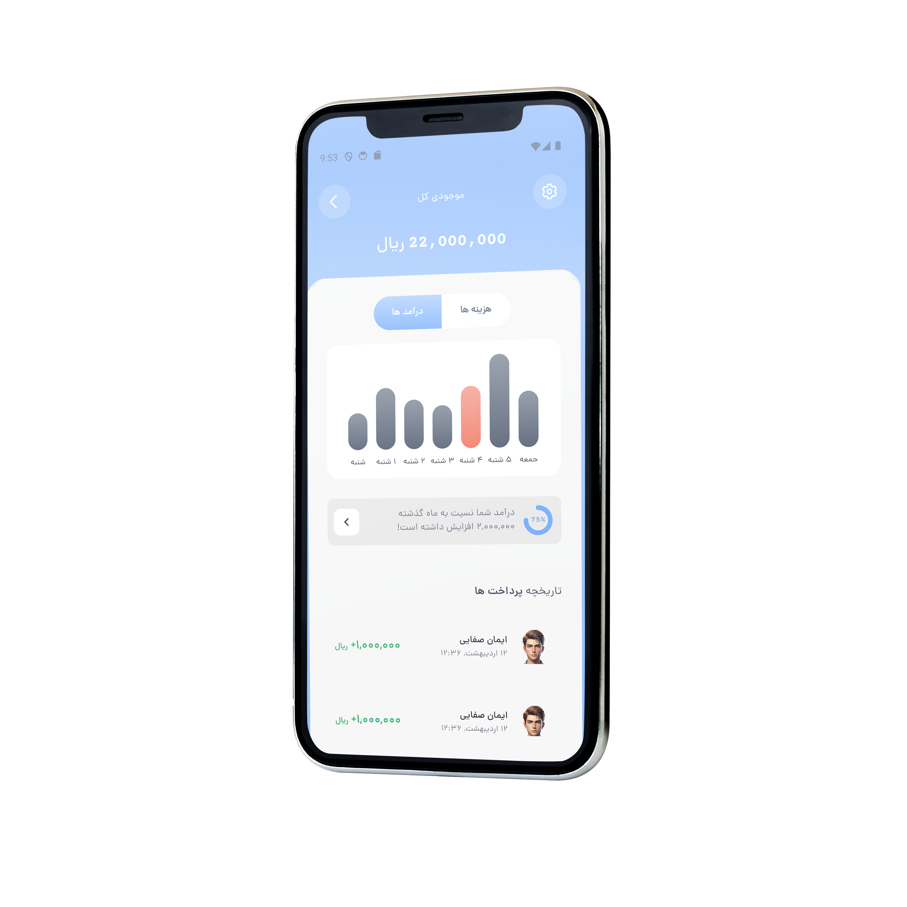

<div style="text-align: right;">
<h1>Finance App</h1>
</div>

یک رابط کاربری ساده اما حرفه‌ای با فلاتر که برای یک اپلیکیشن مالی مدرن ساخته شده است. این پروژه شامل کامپوننت‌های قابل‌استفادهٔ مجدد، چیدمان‌های ریسپانسیو و الگوهای طراحی تمیز است که برای داشبوردها، فهرست تراکنش‌ها، خلاصه‌ هزینه‌ها و صفحات بودجه‌بندی مناسب‌اند. این پروژه یک نقطهٔ شروع سبک و کارآمد برای توسعه‌دهندگانی است که قصد دارند طراحی UI در فلاتر را بیاموزند یا اپلیکیشن‌های موبایل مرتبط با امور مالی بسازند.  [DivSlayer](https://DivSlayer.github.io)


## ساخته شده توسط 🛠
<div style="text-align: right;direction:rtl">
    <ul>
        <li>[فلاتر] برای طراحی UI , UX</li>
    </ul>
</div>

## نصب
برای نصب این اپلیکیشن، دستورات زیر را اجرا کنید:

```bash
git clone https://github.com/DivSlayer/Finance-App.git
cd finance-app
flutter build apk
```

## تصاویر 📸
| ورود | خانه | نمودار |
|----------------------|----------------------|----------------------|
||||


